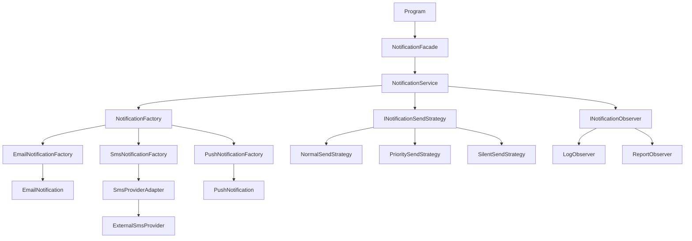

# Evrimleşen Bildirim Sistemi

## Konu Seçimi

Seçilen konu: **A - Bildirim Sistemi**

Bu konuyu seçtim çünkü bildirim sistemleri e-posta, SMS ve push gibi farklı bildirim türlerini içerdiği için tasarım örüntülerini göstermek açısından uygun bir örnektir. Başlangıçta tüm bildirim tiplerinin tek bir sınıfta yönetilmesi, if-else yapılarının büyümesi ve yeni bildirim türü eklemenin zorlaşması gibi sorunları açık şekilde göstermektedir. Bu nedenle bu proje Factory Method, Adapter, Facade, Strategy ve Observer örüntülerini aşamalı olarak uygulamak için uygun bir yapı sağlamaktadır.

## Proje Hakkında

Bu proje, Yazılım Tasarım Örüntüleri dersi kapsamında geliştirilmiş bir **C# Console App** projesidir.

Projenin amacı, başlangıçta basit ve genişletilmesi zor olan bir bildirim sistemini tasarım örüntüleri kullanarak daha düzenli, esnek ve genişletilebilir hale getirmektir.

Sistem şu bildirim türlerini desteklemektedir:

- E-posta bildirimi
- SMS bildirimi
- Push bildirimi

Proje ilerledikçe bildirim nesnelerinin oluşturulması, dış servis uyumluluğu, bildirim gönderme süreci, gönderim davranışları ve bildirim sonrası işlemler farklı tasarım örüntüleriyle ayrılmıştır.

## Kullanılan Tasarım Örüntüleri

| Faz | Örüntü | Kısa Açıklama |
|---|---|---|
| Faz 1 | Factory Method | Bildirim nesnelerinin oluşturulmasını factory sınıflarına taşır. |
| Faz 2 | Adapter | Dış SMS sağlayıcısını mevcut `INotification` yapısına uyumlu hale getirir. |
| Faz 2 | Facade | Bildirim gönderme sürecini daha sade bir arayüz üzerinden yönetir. |
| Faz 3 | Strategy | Farklı bildirim gönderme davranışlarını ayrı sınıflara ayırır. |
| Faz 3 | Observer | Bildirim sonrası loglama ve raporlama işlemlerini otomatik tetikler. |

## Örüntülerin Projedeki Kullanımı

### Factory Method

Factory Method, bildirim nesnelerinin oluşturulmasını düzenlemek için kullanılmıştır.

Bu yapı sayesinde `NotificationService` sınıfı, hangi bildirimin nasıl oluşturulduğunu bilmek zorunda kalmaz. E-posta, SMS ve push bildirimleri için ayrı factory sınıfları oluşturulmuştur.

Kullanılan sınıflar:

- `NotificationFactory`
- `EmailNotificationFactory`
- `SmsNotificationFactory`
- `PushNotificationFactory`

### Adapter

Adapter Pattern, dışarıdan gelen SMS sağlayıcısını mevcut sisteme uyumlu hale getirmek için kullanılmıştır.

`ExternalSmsProvider` sınıfı doğrudan `INotification` arayüzüne uymadığı için `SmsProviderAdapter` sınıfı oluşturulmuştur. Böylece dış SMS servisi mevcut bildirim sistemine zarar vermeden kullanılabilir hale gelmiştir.

Kullanılan sınıflar:

- `ExternalSmsProvider`
- `SmsProviderAdapter`
- `INotification`

### Facade

Facade Pattern, bildirim gönderme sürecini sadeleştirmek için kullanılmıştır.

`NotificationFacade` sınıfı sayesinde `Program.cs` içinde e-posta, SMS ve push bildirimlerini tek tek yönetmek yerine daha anlaşılır bir kullanım sağlanmıştır.

Kullanılan sınıf:

- `NotificationFacade`

### Strategy

Strategy Pattern, bildirimlerin nasıl gönderileceğini ayrı davranış sınıflarına ayırmak için kullanılmıştır.

Bu sayede normal gönderim, öncelikli gönderim ve sessiz gönderim gibi davranışlar ayrı sınıflar halinde yönetilmiştir.

Kullanılan sınıflar:

- `INotificationSendStrategy`
- `NormalSendStrategy`
- `PrioritySendStrategy`
- `SilentSendStrategy`

Bu yapı Açık/Kapalı Prensibine de örnek oluşturmaktadır. Yeni bir gönderim davranışı eklemek için mevcut servis kodunu değiştirmek yerine yeni bir strategy sınıfı eklemek yeterlidir.

### Observer

Observer Pattern, bildirim gönderildikten sonra otomatik çalışacak işlemleri yönetmek için kullanılmıştır.

Bildirim gönderildiğinde loglama ve raporlama işlemleri otomatik olarak tetiklenmektedir.

Kullanılan sınıflar:

- `NotificationEvent`
- `INotificationObserver`
- `LogObserver`
- `ReportObserver`
- `INotificationSubject`

## Mimari Diyagram

Aşağıdaki diyagram, projenin son halindeki temel sınıf ilişkilerini göstermektedir.



Detaylı UML diyagramları şu dosyalarda bulunmaktadır:

- `docs/diagrams/phase1-uml.md`
- `docs/diagrams/phase2-uml.md`
- `docs/diagrams/phase3-uml.md`

## Açık/Kapalı Prensibi

Projede Açık/Kapalı Prensibi özellikle `SilentSendStrategy` sınıfı üzerinden gösterilmiştir.

Sisteme yeni bir gönderim davranışı eklemek için mevcut bildirim sınıflarını veya servis yapısını baştan yazmaya gerek kalmamıştır. Yeni davranış ayrı bir strategy sınıfı olarak eklenmiştir.

Bu durum sistemin yeni davranışlara açık, mevcut çalışan kodu değiştirmeye ise kapalı olduğunu göstermektedir.

## Proje Klasör Yapısı

```text
Evrimlesen-Bildirim-Sistemi
├── README.md
├── PATTERNS.md
├── PROBLEMS.md
├── src/
│   └── NotificationSystem/
│       ├── Program.cs
│       └── NotificationSystem.csproj
├── docs/
│   ├── ai-log/
│   │   ├── phase1.md
│   │   ├── phase2.md
│   │   └── phase3.md
│   └── diagrams/
│       ├── phase1-uml.md
│       ├── phase2-uml.md
│       └── phase3-uml.md
└── .github/
    └── workflows/
        └── ci.yml
```

## Nasıl Çalıştırılır?

Projeyi çalıştırmak için bilgisayarda **.NET 8 SDK** kurulu olmalıdır.

Terminal üzerinden proje klasörüne girilir:

```bash
cd src/NotificationSystem
```

Ardından proje çalıştırılır:

```bash
dotnet run
```

Visual Studio üzerinden çalıştırmak için:

1. `NotificationSystem.sln` dosyası açılır.
2. `Ctrl + F5` ile proje çalıştırılır.
3. Konsol ekranında bildirim gönderme çıktıları görülür.

## Örnek Çıktı

Program çalıştırıldığında e-posta, SMS ve push bildirimleri gönderilir. Ayrıca Strategy ve Observer örüntülerinin çıktıları konsolda görülür.

```text
Normal gönderim stratejisi kullanılıyor.
E-posta bildirimi gönderiliyor...
E-posta gönderildi.
[LOG] Bildirim gönderildi.
[RAPOR] Bildirim rapor sistemine eklendi.

Öncelikli gönderim stratejisi kullanılıyor.
Push bildirimi gönderiliyor...
Push bildirimi gönderildi.
[LOG] Bildirim gönderildi.
[RAPOR] Bildirim rapor sistemine eklendi.
```

## Fazlara Göre Gelişim

### Faz 0

Başlangıç kodundaki tasarım problemleri incelenmiştir. Bu analiz `PROBLEMS.md` dosyasına yazılmıştır.

### Faz 1

Factory Method uygulanarak bildirim nesnelerinin oluşturulması ayrı factory sınıflarına taşınmıştır.

### Faz 2

Adapter ve Facade örüntüleri uygulanmıştır. Dış SMS servisi sisteme uyumlu hale getirilmiş ve bildirim gönderme süreci sadeleştirilmiştir.

### Faz 3

Strategy ve Observer örüntüleri uygulanmıştır. Bildirim gönderme davranışları ayrılmış ve bildirim sonrası loglama/raporlama işlemleri otomatik hale getirilmiştir.

## AI Kullanımı

Her fazda AI desteği alınmıştır. AI cevapları doğrudan kopyalanmamış, öneriler incelenmiş ve proje yapısına uygun şekilde uygulanmıştır.

AI kullanım kayıtları şu dosyalarda tutulmuştur:

- `docs/ai-log/phase1.md`
- `docs/ai-log/phase2.md`
- `docs/ai-log/phase3.md`

## GitHub Actions

Projeye basit bir GitHub Actions CI pipeline eklenmiştir.

`.github/workflows/ci.yml` dosyası ile proje her push veya pull request işleminde otomatik olarak derlenir. Böylece projenin GitHub üzerinde çalışır ve derlenebilir durumda olduğu kontrol edilir.