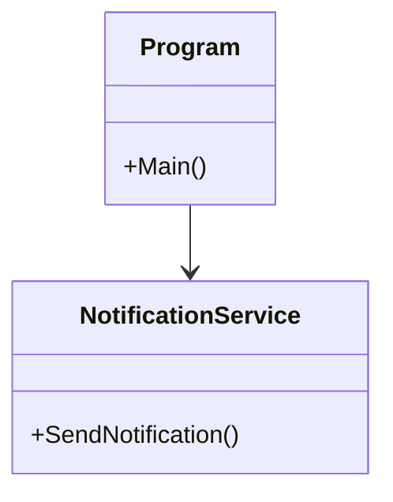
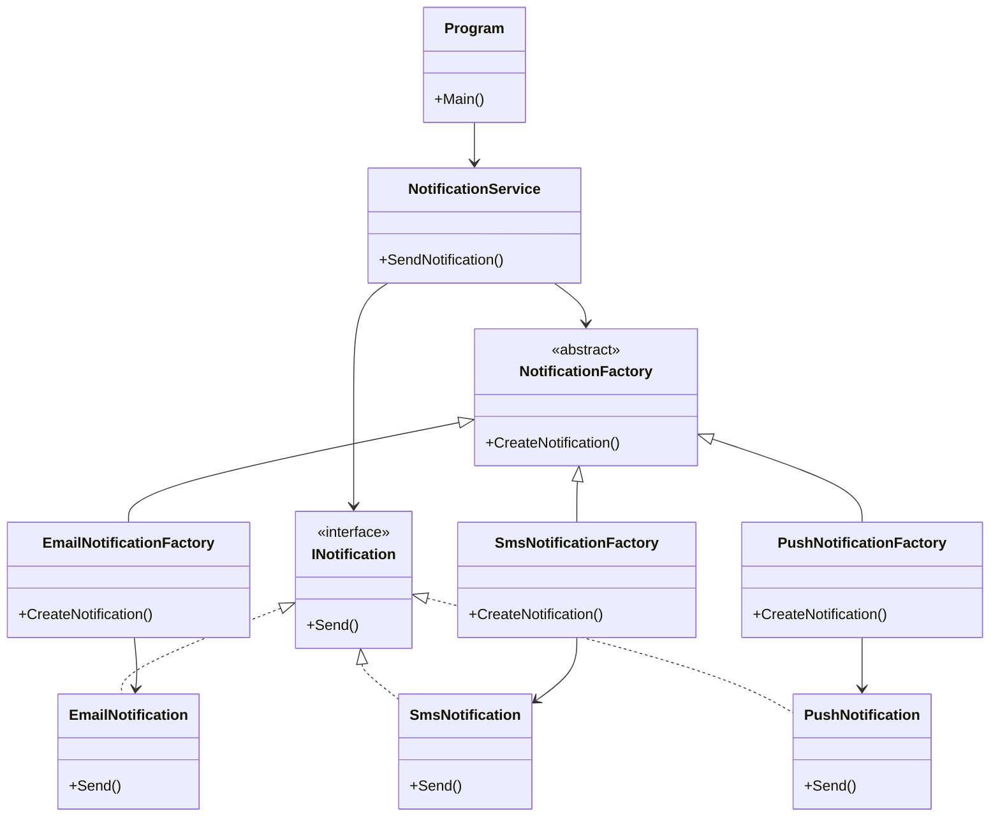

# Phase 1 UML Diyagramları

Bu dosyada Faz 1 öncesi ve Faz 1 sonrası sınıf yapısı gösterilmiştir. Faz 1'de Factory Method örüntüsü uygulanarak bildirim nesnesi oluşturma sorumluluğu `NotificationService` sınıfından ayrılmıştır.

---

## Faz 1 Öncesi UML

Başlangıç kodunda tüm bildirim türleri tek bir `NotificationService` sınıfı içinde `if-else` bloklarıyla yönetiliyordu.

---

## Faz 1 Sonrası UML

Faz 1 sonrasında bildirim nesnesi oluşturma sorumluluğu Factory sınıflarına taşındı. `NotificationService` artık hangi bildirimin nasıl oluşturulduğunu bilmek zorunda değildir.

---

## Kısa Açıklama

Başlangıç yapısında NotificationService sınıfı hem bildirim türünü seçiyor hem de gönderme işlemini yapıyordu. Bu yüzden sınıfın sorumluluğu fazlaydı.

Factory Method uygulandıktan sonra bildirim nesnesi oluşturma işlemi ayrı Factory sınıflarına taşındı. Böylece NotificationService sınıfı daha sade hale geldi ve yeni bildirim türü eklemek daha kolaylaştı.