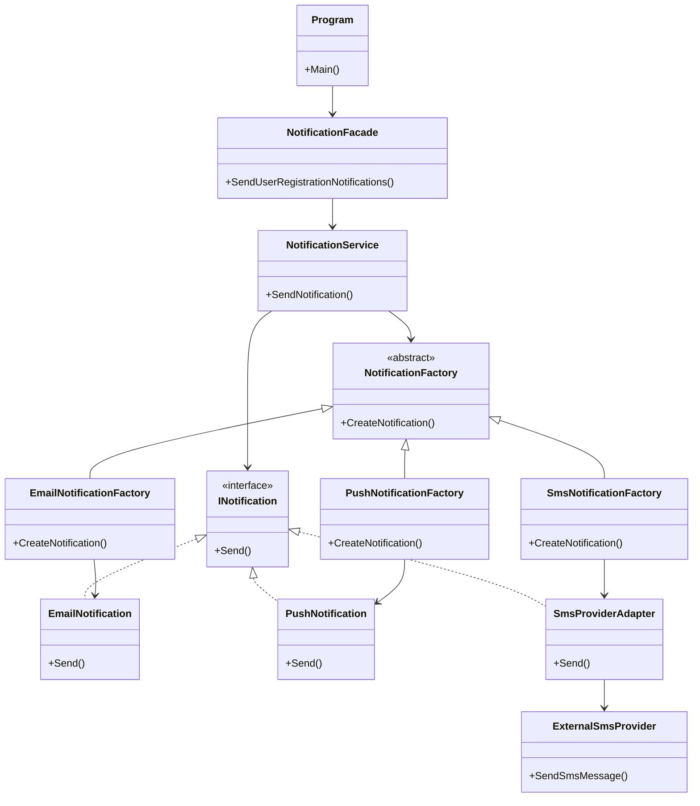

# Phase 2 UML / Mimari Diyagramı

Bu dosyada Faz 2 sonrasında sistemin güncellenmiş mimari yapısı gösterilmiştir. Bu fazda Structural Design Pattern grubundan **Adapter** ve **Facade** örüntüleri uygulanmıştır.

---

## Faz 2 Sonrası UML Diyagramı

---

## Kısa Açıklama

Faz 2'de sisteme iki Structural Pattern eklenmiştir.

İlk olarak **Adapter Pattern** kullanılmıştır. `ExternalSmsProvider` sınıfı sistemdeki `INotification` arayüzüne doğrudan uymadığı için `SmsProviderAdapter` sınıfı oluşturulmuştur. Bu adapter sınıfı, dış SMS sağlayıcısını mevcut bildirim sistemine uyumlu hale getirmiştir.

İkinci olarak **Facade Pattern** kullanılmıştır. `NotificationFacade` sınıfı, kullanıcı kaydı sonrası gönderilecek e-posta, SMS ve push bildirimlerini tek bir metot altında toplamıştır. Böylece `Program.cs` tarafında daha sade ve anlaşılır bir kullanım sağlanmıştır.

Bu faz sonunda sistem, mevcut yapıyı bozmadan dış servis entegrasyonu yapabilir hale gelmiş ve bildirim gönderme süreci daha kolay kullanılabilir duruma getirilmiştir.