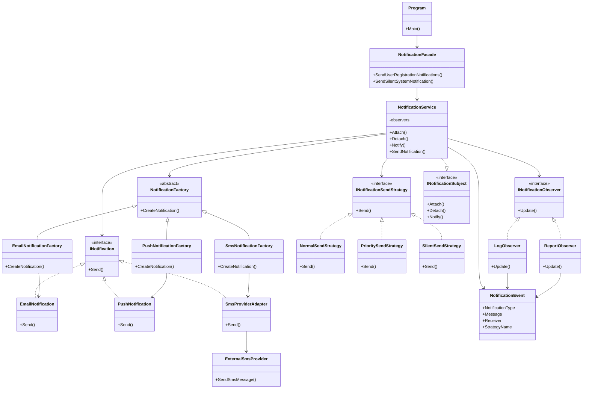

# Phase 3 UML / Mimari Diyagramı

Bu dosyada Faz 3 sonrasında sistemin güncellenmiş mimari yapısı gösterilmiştir. Bu fazda Behavioral Design Pattern grubundan **Strategy** ve **Observer** örüntüleri uygulanmıştır.

---

## Faz 3 Sonrası UML Diyagramı

---

## Kısa Açıklama

Faz 3'te sisteme iki Behavioral Pattern eklenmiştir.

İlk olarak **Strategy Pattern** kullanılmıştır. Bildirimlerin nasıl gönderileceği `INotificationSendStrategy` arayüzü ile soyutlanmıştır. `NormalSendStrategy`, `PrioritySendStrategy` ve `SilentSendStrategy` sınıfları farklı gönderim davranışlarını temsil etmektedir.

Bu yapı sayesinde yeni bir gönderim davranışı eklemek için mevcut servis sınıfını değiştirmek yerine yeni bir strategy sınıfı eklemek yeterli olur. Bu durum Açık/Kapalı Prensibini göstermektedir.

İkinci olarak **Observer Pattern** kullanılmıştır. `NotificationService` sınıfı bildirim gönderildikten sonra sisteme bağlı observer sınıflarını bilgilendirir. `LogObserver` ve `ReportObserver` sınıfları bildirim sonrası loglama ve raporlama işlemlerini otomatik olarak yürütür.

Bu faz sonunda sistem davranış açısından daha genişletilebilir hale gelmiştir.